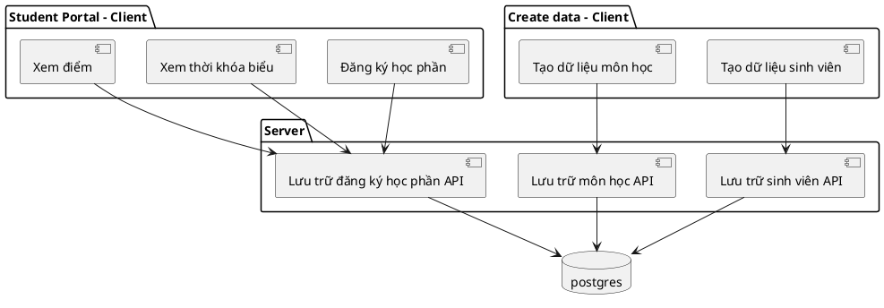

```
@startuml

Interface StudentStorage {
    Student()
    Save()
    Delete()
}

Interface SubjectStorage {
    Subject()
    Save()
    Delete()
}

Interface EnrollStorage {
    Enroll()
    EnrollByStudent()
    EnrollBySubject()
    TryEnroll()
    TryEnrollByStudent()
    TryEnrollBySubject()
    Save()
    SaveTry()
    Delete()
    DeleteTry()
}

class StudentGorm {
    db *gorm.DB
}

class SubjectGorm {
    db *gorm.DB
}

class EnrollGorm {
    db *gorm.DB
}

class StudentService {
    Student()
    Save()
    Delete()
    TryEnroll()
    DeleteTryEnroll()
}

class SubjectService {
    Subject()
    Save()
    Delete()
}

class EnrollService {
    RealEnroll()
}

class StudentTransport
class SubjectTransport
class EnrollTransport

StudentStorage <|.. StudentGorm
SubjectStorage <|.. SubjectGorm
EnrollStorage <|.. EnrollGorm

StudentStorage <.. StudentService
EnrollStorage <.. StudentService
SubjectStorage <.. SubjectService
EnrollStorage <.. SubjectService
EnrollStorage <.. EnrollService

StudentService <.. StudentTransport
SubjectService <.. SubjectTransport
EnrollService <.. EnrollTransport

@enduml
```
